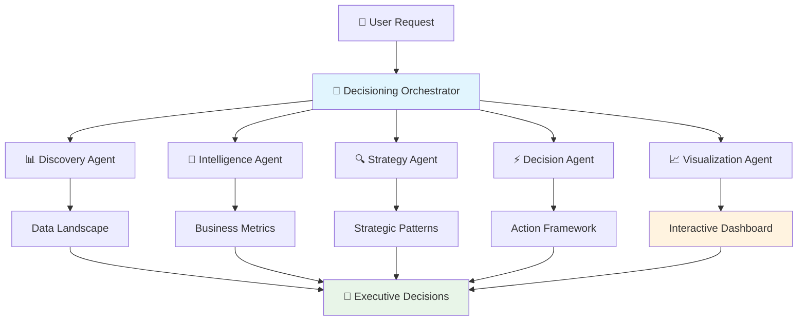
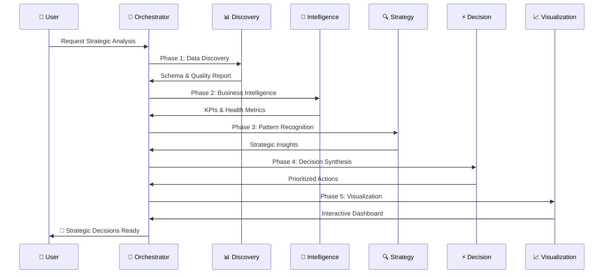
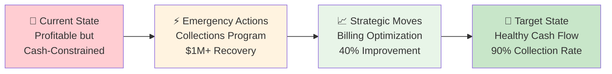

# Decisioning Agentic Flow

An intelligent decision-making system that uses autonomous agents to discover, analyze, and synthesize multi-source business data into actionable insights and strategic recommendations.

## 🎯 Project Overview

This project creates an autonomous agentic system that:
- **Discovers** and catalogs data sources automatically
- **Analyzes** business metrics and KPIs across multiple systems
- **Identifies** patterns, anomalies, and improvement opportunities
- **Generates** interactive dashboards and executive reports
- **Recommends** prioritized actions with business impact analysis

## 🏗️ Architecture

### Agent Flow Overview



### Detailed Agent Workflow



### Current Implementation (MVP)
- **Framework**: Python orchestration with autonomous agents
- **Agent Coordination**: Sequential execution with result synthesis
- **Primary Data Source**: Oracle Database via MCP connector
- **Visualization**: Streamlit interactive dashboard
- **Deployment**: Local development, containerized for production

### Migration Path to CrewAI
- **Target Framework**: CrewAI for advanced multi-agent orchestration
- **Enhanced Coordination**: Hierarchical task delegation and agent memory
- **Extensible Design**: Plugin architecture for new data sources
- **Scalable Infrastructure**: Cloud-native deployment with auto-scaling

📊 **[View Complete Architecture Diagrams](docs/architecture_diagrams.md)**

## 🚀 Quick Start

### Prerequisites
```bash
pip install -r requirements.txt
```

### Run Analysis
```bash
python business_intel_flow.py
```

### View Dashboard
```bash
streamlit run dashboard.py
```

## 📁 Project Structure

```
decisioning-agentic-flow/
├── README.md                    # This file
├── requirements.txt             # Python dependencies
├── config/
│   ├── bi_config.json          # Business intelligence configuration
│   └── data_sources.yaml       # Data source definitions
├── src/
│   ├── agents/                 # Individual agent implementations
│   │   ├── discovery_agent.py  # Data discovery and cataloging
│   │   ├── metrics_agent.py    # Business metrics calculation
│   │   ├── pattern_agent.py    # Pattern recognition and insights
│   │   └── viz_agent.py        # Dashboard and visualization
│   ├── orchestration/          # Workflow coordination
│   │   ├── orchestrator.py     # Main workflow orchestrator
│   │   └── task_manager.py     # Task scheduling and management
│   ├── connectors/             # Data source connectors
│   │   ├── oracle_mcp.py       # Oracle MCP connector
│   │   ├── api_connector.py    # Generic API connector
│   │   └── file_connector.py   # File-based data sources
│   └── utils/                  # Utility functions
│       ├── data_models.py      # Unified data models
│       └── helpers.py          # Common helper functions
├── dashboards/                 # Dashboard implementations
│   ├── streamlit_app.py        # Main Streamlit dashboard
│   └── templates/              # Dashboard templates
├── docs/                       # Documentation
│   ├── architecture.md         # System architecture
│   ├── agent_specs.md          # Agent specifications
│   └── crewai_migration.md     # Migration framework
├── tests/                      # Test suite
│   ├── test_agents.py          # Agent unit tests
│   └── test_integration.py     # Integration tests
├── deployment/                 # Deployment configurations
│   ├── docker/                 # Docker configurations
│   └── k8s/                    # Kubernetes manifests
└── examples/                   # Example configurations and outputs
    ├── sample_config.json      # Sample configuration
    └── sample_output.json      # Sample analysis output
```

## 🤖 Agent Ecosystem

### Core Agents & Capabilities

#### 📊 **Discovery Agent** - Data Intelligence
```
Input: Raw data sources (Oracle, APIs, files)
Process: Schema analysis → Quality assessment → Relationship mapping
Output: Comprehensive data landscape report
Business Value: Identifies data quality issues and optimization opportunities
```

#### 💼 **Intelligence Agent** - Business Analytics
```
Input: Data landscape + business context
Process: Financial analysis → Operational metrics → Customer intelligence
Output: Business health scores and performance insights
Business Value: Quantifies business performance and identifies critical issues
```

#### 🔍 **Strategy Agent** - Pattern Recognition
```
Input: Business intelligence + market context
Process: Pattern detection → Risk analysis → Opportunity identification
Output: Strategic insights and transformation opportunities
Business Value: Uncovers hidden patterns and strategic advantages
```

#### ⚡ **Decision Agent** - Strategic Synthesis
```
Input: All agent outputs + business objectives
Process: Priority analysis → Impact assessment → Resource planning
Output: Prioritized decision framework with timelines
Business Value: Transforms insights into executable strategic actions
```

#### 📈 **Visualization Agent** - Interactive Intelligence
```
Input: Decision framework + analysis results
Process: Chart generation → Dashboard assembly → Report creation
Output: Interactive dashboards and executive reports
Business Value: Makes complex data accessible for decision-making
```

### Agent Intelligence Levels

| Agent | Autonomy | Learning | Business Impact |
|-------|----------|----------|-----------------|
| Discovery | ⭐⭐⭐⭐ | Data Quality | Foundation |
| Intelligence | ⭐⭐⭐⭐⭐ | Business Context | Critical |
| Strategy | ⭐⭐⭐⭐⭐ | Market Patterns | Strategic |
| Decision | ⭐⭐⭐⭐⭐ | Executive Context | Transformational |
| Visualization | ⭐⭐⭐ | User Preferences | Operational |

### Extensible Design

- **Plugin Architecture**: Easy addition of new agents and data sources
- **Unified Data Model**: Consistent schema mapping across sources
- **Event-Driven**: Reactive to data changes and business events

## 📊 Business Impact

### Real-World Analysis Results (Oracle FUSION_DEMO)

#### Financial Intelligence Dashboard
```
┌─────────────────────────────────────────────────────────────┐
│                    EXECUTIVE DASHBOARD                     │
├─────────────────────────────────────────────────────────────┤
│ 🎯 Business Health Score: 65/100 (CRITICAL)               │
│ 💰 Total Revenue: $4.12M (80.06% margin) ✅                │
│ 🚨 Outstanding AR: $2.48M (98% overdue) ⚠️                 │
│ 📈 Collection Rate: 40% (vs 85% industry) ⚠️               │
├─────────────────────────────────────────────────────────────┤
│ IMMEDIATE DECISIONS REQUIRED:                              │
│ ⚡ Emergency Collections Program (48 hours)                │
│ 📋 Milestone Billing Implementation (30 days)              │
│ 👥 Customer Portfolio Optimization (90 days)               │
└─────────────────────────────────────────────────────────────┘
```

#### Strategic Decision Framework


### Measurable Business Value

| Metric | Current | Target | Improvement |
|--------|---------|--------|-------------|
| Collection Rate | 40% | 90% | +125% |
| Cash Recovery | $0 | $1.8M | $1.8M |
| Overdue AR | 98% | <20% | -80% |
| Billing Velocity | 1.5x | 4.0x | +167% |
| Business Health | 65/100 | 85/100 | +31% |

### Agent-Generated Insights
- **28 Strategic Insights** discovered across all business areas
- **28 Actionable Recommendations** with priority rankings
- **$2.48M Value at Risk** identified and quantified
- **$1.8M+ Recovery Potential** with specific action plans
- **90-day transformation roadmap** with measurable milestones

## 🔧 Technology Stack

- **Core Language**: Python 3.9+
- **Agent Framework**: Claude Code Tasks (MVP) → CrewAI (Production)
- **Database Connectors**: MCP (Model Context Protocol)
- **Visualization**: Streamlit, Plotly, D3.js
- **Data Processing**: Pandas, NumPy
- **Containerization**: Docker
- **Orchestration**: Kubernetes (production)

## 📈 Roadmap

### Phase 1: MVP (Current)
- [x] Oracle database analysis
- [x] Basic agent workflow
- [x] Streamlit dashboard
- [ ] End-to-end testing

### Phase 2: Multi-Source
- [ ] Additional data source connectors
- [ ] Cross-source correlation analysis
- [ ] Enhanced pattern recognition

### Phase 3: Production
- [ ] CrewAI migration
- [ ] Cloud deployment
- [ ] Real-time processing
- [ ] Advanced ML insights

### Phase 4: Enterprise
- [ ] White-label dashboards
- [ ] API-first architecture
- [ ] Enterprise security
- [ ] Custom business rules engine

## 🤝 Contributing

1. Fork the repository
2. Create a feature branch (`git checkout -b feature/amazing-feature`)
3. Commit your changes (`git commit -m 'Add amazing feature'`)
4. Push to the branch (`git push origin feature/amazing-feature`)
5. Open a Pull Request

## 📄 License

This project is licensed under the MIT License - see the [LICENSE](LICENSE) file for details.

## 🔗 Links

- [Architecture Documentation](docs/architecture.md)
- [Agent Specifications](docs/agent_specs.md)
- [CrewAI Migration Guide](docs/crewai_migration.md)
- [API Documentation](docs/api.md)

## 📧 Contact

For questions or collaboration opportunities, please open an issue or reach out to the project maintainers.

---

**Built with ❤️ and AI-driven insights**