# Architecture Diagrams - Decisioning Agentic Flow

## 🏗️ Agent Flow Architecture

### High-Level Agent Orchestration

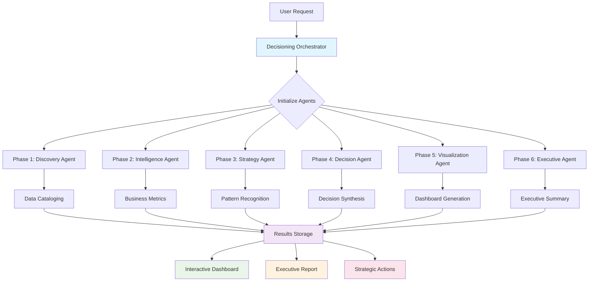

### Detailed Agent Workflow

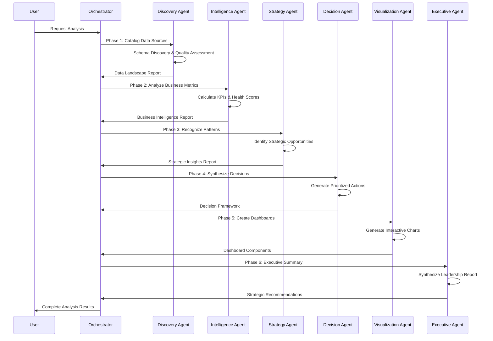

## 🤖 Individual Agent Architecture

### Discovery Agent - Data Intelligence

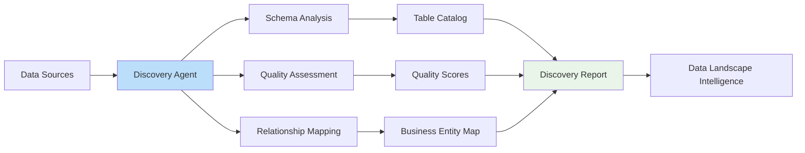

### Intelligence Agent - Business Analytics

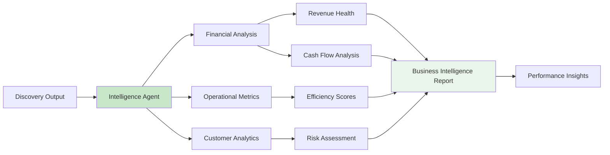

### Strategy Agent - Pattern Recognition

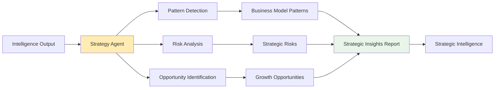

### Decision Agent - Strategic Synthesis

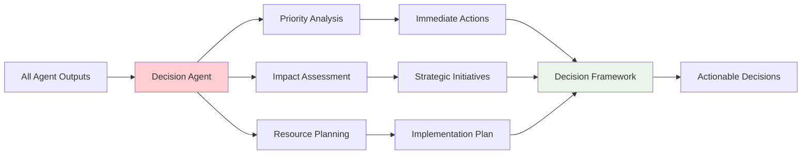

### Visualization Agent - Interactive Intelligence

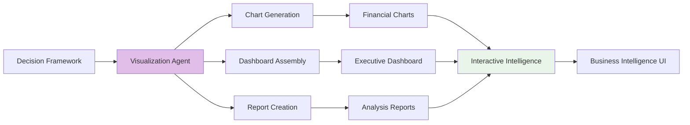

## 📊 Data Flow Architecture

### Multi-Source Data Integration

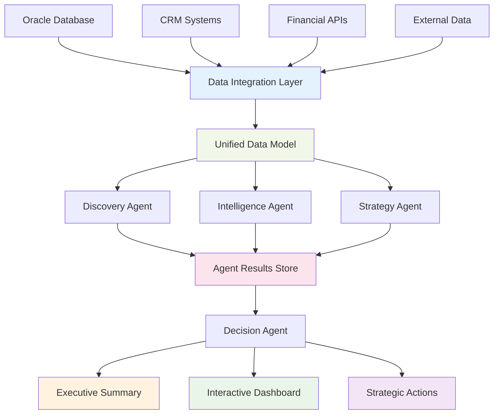

## 🔄 CrewAI Migration Architecture

### Current MVP vs Target CrewAI

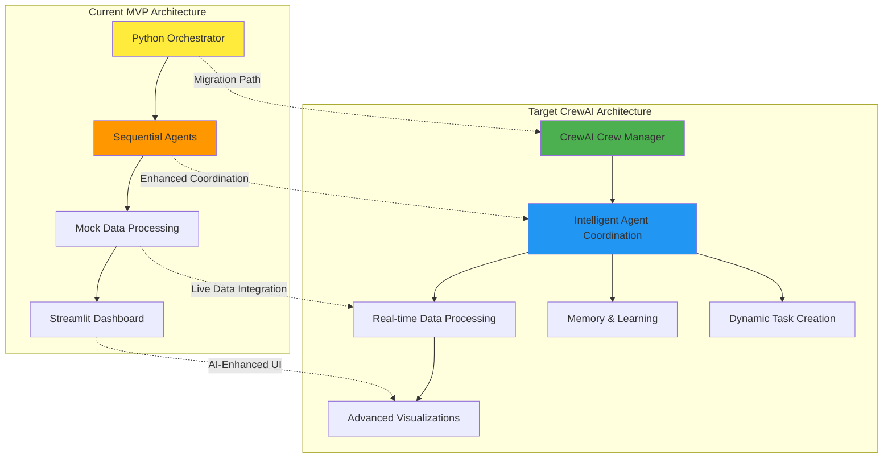

## 🎯 Business Intelligence Flow

### From Data to Decisions

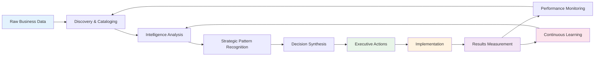

## 🚀 Deployment Architecture

### Production Scaling

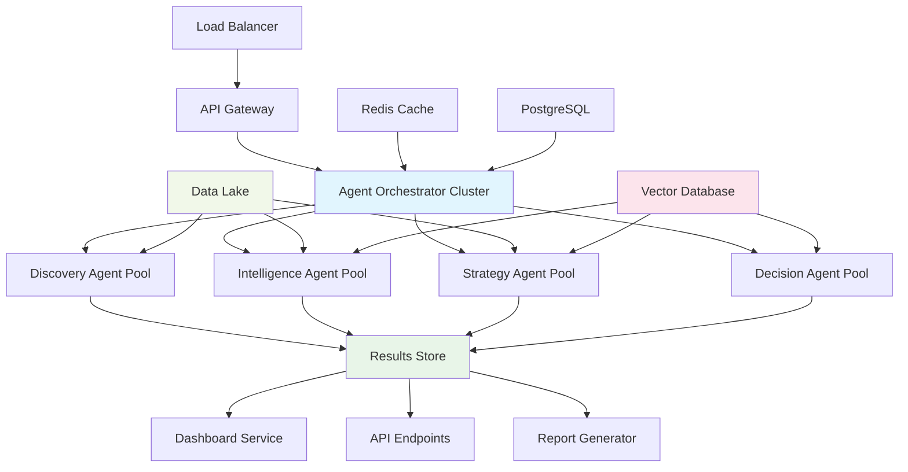

---

These diagrams illustrate the complete architecture from individual agent logic through enterprise deployment scenarios, showing how the Decisioning Agentic Flow scales from MVP to production-ready business intelligence platform.