# Conversational Agent Architecture - Dynamic AI-Powered System

## 🎯 Architecture Overview

This system creates a fully dynamic, AI-powered conversational interface where users can ask questions about their business data and receive intelligent responses routed through specialized agents.

### Core Principle: **No Static Rules, Pure AI Decision-Making**

```mermaid
graph TB
    subgraph "User Interface"
        A[📱 Interactive Dashboard]
        B[💬 Question Input]
        C[🎙️ Voice Interface]
    end

    subgraph "Query Processing Layer"
        D[🤖 Query Router Agent<br/>Claude Sonnet]
        E[🔍 Intent Analysis]
        F[📊 Context Enrichment]
    end

    subgraph "Specialized AI Agents"
        G[💼 Intelligence Agent<br/>Claude Sonnet]
        H[📊 Discovery Agent<br/>Claude Sonnet]
        I[🔍 Strategy Agent<br/>Claude Sonnet]
        J[⚡ Decision Agent<br/>Claude Sonnet]
        K[📈 Forecasting Agent<br/>Claude Sonnet]
        L[🎨 Visualization Agent<br/>Claude Sonnet]
    end

    subgraph "Data Layer"
        M[🔥 HeatWave OLTP/OLAP]
        N[📊 Real-time Analytics]
        O[🧠 Vector Embeddings]
    end

    subgraph "Response Generation"
        P[📝 Response Synthesis]
        Q[📊 Dynamic Visualizations]
        R[🎯 Follow-up Questions]
    end

    A --> B
    B --> D
    C --> D

    D --> E
    E --> F
    F --> G
    F --> H
    F --> I
    F --> J
    F --> K
    F --> L

    G --> M
    H --> M
    I --> N
    J --> O
    K --> M
    L --> N

    G --> P
    H --> P
    I --> P
    J --> P
    K --> Q
    L --> Q

    P --> R
    Q --> R
    R --> A

    style D fill:#ff6b35
    style G fill:#42a5f5
    style H fill:#42a5f5
    style I fill:#42a5f5
    style J fill:#42a5f5
    style K fill:#42a5f5
    style L fill:#42a5f5
```



## 🤖 Query Router Agent - The Brain

### Core Responsibilities

**1. Natural Language Understanding**
- Parse user questions in any format
- Extract intent and context
- Identify data requirements
- Determine urgency and complexity

**2. Intelligent Agent Selection**
- Route questions to appropriate specialists
- Coordinate multi-agent responses
- Handle complex queries requiring multiple agents
- Adapt routing based on question patterns

**3. Context Management**
- Maintain conversation history
- Track dashboard state
- Remember user preferences
- Build semantic understanding

### Implementation

```python
import anthropic
import json
import asyncio
from datetime import datetime
from typing import Dict, List, Any, Optional

class QueryRouterAgent:
    """AI-powered query router using Claude Sonnet for intelligent routing"""

    def __init__(self, config: Dict):
        self.claude_client = anthropic.Anthropic(
            api_key=config['claude_api_key']
        )
        self.agent_registry = self._initialize_agent_registry()
        self.conversation_history = []
        self.dashboard_context = {}

    async def process_question(self, question: str, user_context: Dict = None) -> Dict:
        """Process user question and route to appropriate agents"""

        # Step 1: Analyze the question with Claude
        analysis = await self._analyze_question_with_claude(question, user_context)

        # Step 2: Route to appropriate agents
        agent_responses = await self._route_to_agents(analysis)

        # Step 3: Synthesize final response
        final_response = await self._synthesize_response(question, analysis, agent_responses)

        # Step 4: Update conversation history
        self._update_conversation_history(question, final_response)

        return final_response

    async def _analyze_question_with_claude(self, question: str, user_context: Dict) -> Dict:
        """Use Claude to deeply understand the question"""

        context_prompt = f"""
        Dashboard Context: {json.dumps(self.dashboard_context, indent=2)}
        Recent Conversation: {json.dumps(self.conversation_history[-3:], indent=2)}
        User Context: {json.dumps(user_context or {}, indent=2)}

        User Question: "{question}"

        As an AI business intelligence router, analyze this question and provide:

        1. INTENT_CLASSIFICATION:
           - Type: [analytical, operational, strategic, forecasting, explanatory, comparative]
           - Urgency: [low, medium, high, critical]
           - Complexity: [simple, moderate, complex, multi-faceted]
           - Time_Horizon: [current, historical, forecasting, real-time]

        2. DATA_REQUIREMENTS:
           - Primary_Entities: [projects, customers, financials, operations, etc.]
           - Metrics_Needed: [specific KPIs, calculations, aggregations]
           - Time_Range: [specific dates, periods, or real-time]
           - Granularity: [daily, weekly, monthly, quarterly, yearly]

        3. AGENT_ROUTING:
           - Primary_Agent: [which agent should lead the response]
           - Supporting_Agents: [additional agents needed]
           - Coordination_Type: [sequential, parallel, hierarchical]
           - Estimated_Complexity: [1-10 scale]

        4. RESPONSE_REQUIREMENTS:
           - Format: [narrative, tabular, visual, interactive]
           - Detail_Level: [summary, detailed, comprehensive]
           - Visualization_Needs: [charts, graphs, dashboards, none]
           - Follow_Up_Suggestions: [related questions user might ask]

        5. BUSINESS_CONTEXT:
           - Strategic_Relevance: [how this relates to business strategy]
           - Decision_Impact: [what decisions this might influence]
           - Stakeholder_Interest: [who would care about this answer]

        Respond in JSON format only.
        """

        try:
            response = await self.claude_client.messages.create(
                model="claude-3-5-sonnet-20241022",
                max_tokens=2000,
                messages=[{"role": "user", "content": context_prompt}]
            )

            return json.loads(response.content[0].text)

        except Exception as e:
            # Fallback analysis if Claude fails
            return self._fallback_question_analysis(question)

    async def _route_to_agents(self, analysis: Dict) -> Dict:
        """Route question to appropriate agents based on Claude's analysis"""

        routing = analysis.get('AGENT_ROUTING', {})
        primary_agent = routing.get('Primary_Agent', 'intelligence')
        supporting_agents = routing.get('Supporting_Agents', [])
        coordination_type = routing.get('Coordination_Type', 'sequential')

        agent_responses = {}

        if coordination_type == 'parallel':
            # Execute agents in parallel for faster response
            tasks = []

            # Primary agent
            if primary_agent in self.agent_registry:
                tasks.append(self._execute_agent(primary_agent, analysis, is_primary=True))

            # Supporting agents
            for agent_name in supporting_agents:
                if agent_name in self.agent_registry:
                    tasks.append(self._execute_agent(agent_name, analysis, is_primary=False))

            # Wait for all agents to complete
            results = await asyncio.gather(*tasks, return_exceptions=True)

            # Process results
            for i, result in enumerate(results):
                if not isinstance(result, Exception):
                    agent_name = primary_agent if i == 0 else supporting_agents[i-1]
                    agent_responses[agent_name] = result

        elif coordination_type == 'sequential':
            # Execute primary agent first
            if primary_agent in self.agent_registry:
                primary_result = await self._execute_agent(primary_agent, analysis, is_primary=True)
                agent_responses[primary_agent] = primary_result

                # Update analysis with primary agent's findings for supporting agents
                analysis['PRIMARY_FINDINGS'] = primary_result.get('data', {})

            # Execute supporting agents with enriched context
            for agent_name in supporting_agents:
                if agent_name in self.agent_registry:
                    result = await self._execute_agent(agent_name, analysis, is_primary=False)
                    agent_responses[agent_name] = result

        return agent_responses

    async def _execute_agent(self, agent_name: str, analysis: Dict, is_primary: bool = False) -> Dict:
        """Execute a specific agent with Claude-enhanced capabilities"""

        agent_config = self.agent_registry[agent_name]
        agent_class = agent_config['class']

        # Create agent instance with Claude integration
        agent = agent_class({
            'claude_client': self.claude_client,
            'analysis_context': analysis,
            'is_primary_agent': is_primary,
            'heatwave_config': self.config.get('heatwave', {}),
            'dashboard_context': self.dashboard_context
        })

        # Execute agent with full context
        result = await agent.execute_with_ai_reasoning(analysis)

        return result.to_dict() if hasattr(result, 'to_dict') else result

    async def _synthesize_response(self, question: str, analysis: Dict, agent_responses: Dict) -> Dict:
        """Use Claude to synthesize a coherent response from multiple agents"""

        synthesis_prompt = f"""
        User asked: "{question}"

        Analysis Context: {json.dumps(analysis, indent=2)}

        Agent Responses: {json.dumps(agent_responses, indent=2)}

        As an executive AI assistant, synthesize these agent responses into a coherent,
        actionable answer that directly addresses the user's question.

        Provide:

        1. DIRECT_ANSWER:
           - Clear, concise response to the specific question
           - Key numbers, facts, and insights
           - Confidence level in the answer

        2. BUSINESS_IMPLICATIONS:
           - What this means for business performance
           - Strategic considerations
           - Risk factors or opportunities

        3. RECOMMENDED_ACTIONS:
           - Specific next steps the user should consider
           - Timeline and priority for each action
           - Resources or stakeholders involved

        4. SUPPORTING_EVIDENCE:
           - Data points that support the conclusion
           - Relevant trends or patterns
           - Comparative context (vs benchmarks, historical, etc.)

        5. FOLLOW_UP_OPPORTUNITIES:
           - Related questions the user might want to explore
           - Deeper analysis suggestions
           - Areas requiring additional investigation

        6. VISUALIZATION_RECOMMENDATIONS:
           - What charts or dashboards would help
           - Interactive elements that would be valuable
           - Real-time monitoring suggestions

        Make the response conversational, executive-level, and immediately actionable.
        Respond in JSON format.
        """

        try:
            response = await self.claude_client.messages.create(
                model="claude-3-5-sonnet-20241022",
                max_tokens=2500,
                messages=[{"role": "user", "content": synthesis_prompt}]
            )

            synthesized = json.loads(response.content[0].text)

            # Add metadata
            synthesized['RESPONSE_METADATA'] = {
                'question': question,
                'agents_involved': list(agent_responses.keys()),
                'response_time': datetime.now().isoformat(),
                'confidence_score': self._calculate_overall_confidence(agent_responses),
                'complexity_handled': analysis.get('AGENT_ROUTING', {}).get('Estimated_Complexity', 5)
            }

            return synthesized

        except Exception as e:
            return self._fallback_response_synthesis(question, agent_responses)

    def _initialize_agent_registry(self) -> Dict:
        """Initialize registry of available AI agents"""
        return {
            'intelligence': {
                'class': AIEnhancedIntelligenceAgent,
                'description': 'Financial and operational intelligence analysis',
                'capabilities': ['financial_analysis', 'kpi_calculation', 'trend_analysis'],
                'specialties': ['revenue', 'profitability', 'cash_flow', 'efficiency']
            },
            'discovery': {
                'class': AIEnhancedDiscoveryAgent,
                'description': 'Data discovery and pattern recognition',
                'capabilities': ['data_exploration', 'anomaly_detection', 'relationship_mapping'],
                'specialties': ['data_quality', 'hidden_patterns', 'correlations']
            },
            'strategy': {
                'class': AIEnhancedStrategyAgent,
                'description': 'Strategic analysis and market insights',
                'capabilities': ['strategic_planning', 'competitive_analysis', 'market_trends'],
                'specialties': ['positioning', 'opportunities', 'threats', 'scenarios']
            },
            'forecasting': {
                'class': AIEnhancedForecastingAgent,
                'description': 'Predictive analytics and forecasting',
                'capabilities': ['time_series_analysis', 'predictive_modeling', 'scenario_planning'],
                'specialties': ['revenue_forecasting', 'demand_planning', 'risk_modeling']
            },
            'decision': {
                'class': AIEnhancedDecisionAgent,
                'description': 'Decision support and optimization',
                'capabilities': ['decision_trees', 'optimization', 'trade_off_analysis'],
                'specialties': ['resource_allocation', 'prioritization', 'trade_offs']
            },
            'visualization': {
                'class': AIEnhancedVisualizationAgent,
                'description': 'Dynamic visualization and dashboard creation',
                'capabilities': ['chart_generation', 'dashboard_design', 'interactive_elements'],
                'specialties': ['executive_dashboards', 'drill_down', 'real_time_charts']
            }
        }
```

## 🧠 AI-Enhanced Specialized Agents

### Intelligence Agent with Claude Integration

```python
class AIEnhancedIntelligenceAgent:
    """Intelligence Agent with full Claude Sonnet reasoning"""

    def __init__(self, config: Dict):
        self.claude_client = config['claude_client']
        self.analysis_context = config.get('analysis_context', {})
        self.heatwave_connection = self._create_heatwave_connection(config)

    async def execute_with_ai_reasoning(self, analysis: Dict) -> Dict:
        """Execute intelligence analysis with AI reasoning"""

        # Step 1: Get raw data from HeatWave
        raw_data = await self._get_heatwave_data(analysis)

        # Step 2: Use Claude for intelligent analysis
        ai_insights = await self._analyze_with_claude(raw_data, analysis)

        # Step 3: Generate dynamic recommendations
        recommendations = await self._generate_ai_recommendations(ai_insights, raw_data)

        return {
            'agent_name': 'intelligence',
            'data': raw_data,
            'ai_insights': ai_insights,
            'recommendations': recommendations,
            'confidence_score': ai_insights.get('confidence_score', 0.85),
            'reasoning_path': ai_insights.get('reasoning_path', [])
        }

    async def _analyze_with_claude(self, data: Dict, context: Dict) -> Dict:
        """Use Claude for deep financial and operational analysis"""

        analysis_prompt = f"""
        You are a senior business intelligence analyst with expertise in financial and operational metrics.

        Raw Data: {json.dumps(data, indent=2)}
        Question Context: {json.dumps(context, indent=2)}

        Perform a comprehensive analysis and provide:

        1. FINANCIAL_INTELLIGENCE:
           - Key financial health indicators
           - Cash flow concerns or strengths
           - Revenue patterns and anomalies
           - Profitability trends and drivers

        2. OPERATIONAL_INTELLIGENCE:
           - Efficiency metrics and bottlenecks
           - Resource utilization patterns
           - Process performance indicators
           - Quality and delivery metrics

        3. RISK_ASSESSMENT:
           - Financial risks (cash flow, credit, market)
           - Operational risks (capacity, quality, delivery)
           - Strategic risks (competitive, regulatory, technological)
           - Risk mitigation priorities

        4. OPPORTUNITY_IDENTIFICATION:
           - Revenue growth opportunities
           - Cost optimization possibilities
           - Process improvement areas
           - Market expansion potential

        5. INTELLIGENT_INSIGHTS:
           - Hidden patterns in the data
           - Correlations between metrics
           - Leading indicators of future performance
           - Anomalies requiring investigation

        6. CONFIDENCE_ASSESSMENT:
           - Data quality and completeness
           - Analysis reliability
           - Uncertainty factors
           - Confidence score (0-1)

        Provide strategic, actionable insights that go beyond basic calculations.
        Respond in JSON format.
        """

        response = await self.claude_client.messages.create(
            model="claude-3-5-sonnet-20241022",
            max_tokens=3000,
            messages=[{"role": "user", "content": analysis_prompt}]
        )

        return json.loads(response.content[0].text)
```

## 💬 Interactive Dashboard Integration

### Enhanced Streamlit Dashboard with Conversational Interface

```python
import streamlit as st
import asyncio
from datetime import datetime

class ConversationalDashboard:
    """Interactive dashboard with AI-powered question answering"""

    def __init__(self):
        self.query_router = QueryRouterAgent(st.secrets)
        self.conversation_history = []

    def render_dashboard(self):
        """Render the main dashboard with conversational interface"""

        st.title("🎯 AI-Powered Business Intelligence Dashboard")

        # Main dashboard content
        col1, col2 = st.columns([2, 1])

        with col1:
            self._render_main_dashboard()

        with col2:
            self._render_ai_assistant()

    def _render_ai_assistant(self):
        """Render the AI assistant interface"""

        st.subheader("🤖 Ask Your Business Intelligence AI")

        # Question input
        question = st.text_input(
            "Ask anything about your business data:",
            placeholder="e.g., Why is our cash flow declining? What are our biggest risks? How can we improve profitability?"
        )

        # Voice input (future enhancement)
        if st.button("🎙️ Voice Input"):
            st.info("Voice input coming soon!")

        # Process question
        if question and st.button("Ask AI"):
            with st.spinner("🧠 AI is analyzing your question..."):
                response = asyncio.run(self.query_router.process_question(
                    question,
                    user_context=self._get_dashboard_context()
                ))

                self._display_ai_response(response)

        # Conversation history
        self._render_conversation_history()

    def _display_ai_response(self, response: Dict):
        """Display AI response in a structured format"""

        # Direct answer
        st.success("🎯 **Answer:**")
        st.write(response.get('DIRECT_ANSWER', {}).get('response', 'No direct answer available'))

        # Confidence score
        confidence = response.get('RESPONSE_METADATA', {}).get('confidence_score', 0)
        st.metric("Confidence", f"{confidence:.1%}")

        # Business implications
        implications = response.get('BUSINESS_IMPLICATIONS', {})
        if implications:
            st.warning("📊 **Business Implications:**")
            st.write(implications.get('strategic_impact', ''))

        # Recommended actions
        actions = response.get('RECOMMENDED_ACTIONS', [])
        if actions:
            st.info("⚡ **Recommended Actions:**")
            for i, action in enumerate(actions, 1):
                st.write(f"{i}. {action}")

        # Supporting evidence
        evidence = response.get('SUPPORTING_EVIDENCE', {})
        if evidence:
            with st.expander("📈 Supporting Evidence"):
                st.json(evidence)

        # Follow-up suggestions
        follow_ups = response.get('FOLLOW_UP_OPPORTUNITIES', [])
        if follow_ups:
            st.write("🔍 **Related Questions You Might Ask:**")
            for follow_up in follow_ups:
                if st.button(f"❓ {follow_up}", key=f"followup_{hash(follow_up)}"):
                    # Auto-populate the question
                    st.rerun()

        # Visualization recommendations
        viz_recs = response.get('VISUALIZATION_RECOMMENDATIONS', {})
        if viz_recs:
            st.write("📊 **Suggested Visualizations:**")
            if st.button("📈 Generate Recommended Charts"):
                self._generate_dynamic_visualizations(viz_recs)

    def _render_conversation_history(self):
        """Render conversation history"""

        if self.conversation_history:
            with st.expander("💬 Conversation History"):
                for i, conversation in enumerate(reversed(self.conversation_history[-5:])):
                    st.write(f"**Q{len(self.conversation_history)-i}:** {conversation['question']}")
                    st.write(f"**A:** {conversation['answer'][:200]}...")
                    st.write("---")

    def _get_dashboard_context(self) -> Dict:
        """Get current dashboard context for AI"""
        return {
            'current_page': 'main_dashboard',
            'visible_metrics': ['revenue', 'cash_flow', 'projects'],
            'time_range': 'last_12_months',
            'user_preferences': {},
            'timestamp': datetime.now().isoformat()
        }

# Example questions the system can handle:
EXAMPLE_QUESTIONS = [
    "Why is our cash flow declining despite good profits?",
    "Which customers are at risk of churning?",
    "What's driving the increase in project costs?",
    "How can we improve our collection efficiency?",
    "What would happen if we lost our top 3 customers?",
    "Where should we focus our sales efforts next quarter?",
    "Are there any patterns in our seasonal business?",
    "What are our biggest operational bottlenecks?",
    "How do we compare to industry benchmarks?",
    "What early warning signs should we monitor?"
]
```

## 🎯 Benefits of This Architecture

### **Dynamic Intelligence**
- No hardcoded rules or static analysis
- AI adapts to any question or business context
- Learns from conversation patterns
- Provides contextual, strategic insights

### **Natural Interaction**
- Ask questions in plain English
- Get executive-level, actionable answers
- Follow-up conversations build context
- Voice interface ready for future enhancement

### **Intelligent Routing**
- AI determines which agents to involve
- Coordinates complex multi-agent responses
- Optimizes for speed vs. comprehensiveness
- Handles edge cases gracefully

### **Real-time Adaptation**
- Agents use live HeatWave data
- AI reasoning adapts to current business state
- Recommendations consider real-time context
- Continuous learning from user interactions

This creates a truly intelligent business intelligence system where you can have natural conversations about your data and get AI-powered insights that adapt to your specific business context! 🚀

Would you like me to implement this conversational architecture, starting with the Query Router Agent and one of the AI-enhanced specialized agents?