# HeatWave OLTP/OLAP Architecture - Dynamic View Generation

## 🏗️ Dual-Engine Architecture Design

### Overview

This architecture leverages MySQL HeatWave's unique capability to run both OLTP and OLAP workloads on the same data, with agents dynamically creating analytical views on the OLAP side while maintaining real-time transactional operations on the OLTP side.

### Architecture Flow

```mermaid
graph TB
    subgraph "Data Ingestion Layer"
        A1[📥 Real-time Transactions]
        A2[📊 Batch Data Imports]
        A3[🔄 Streaming Events]
    end

    subgraph "MySQL HeatWave Cluster"
        subgraph "OLTP Side (Primary MySQL)"
            B1[📝 Transactional Tables]
            B2[🔒 ACID Compliance]
            B3[⚡ Real-time Writes]
        end

        subgraph "OLAP Side (HeatWave Analytics)"
            C1[📊 Dynamic Views]
            C2[🧮 Aggregated Metrics]
            C3[🔍 Analytical Queries]
            C4[🤖 ML Models]
        end
    end

    subgraph "Intelligent Agents"
        D1[📊 Metrics Agent]
        D2[🎯 View Generator Agent]
        D3[💼 Intelligence Agent]
        D4[📈 Forecasting Agent]
    end

    subgraph "Business Layer"
        E1[📈 Real-time Dashboards]
        E2[📊 Executive Reports]
        E3[🚨 Alert System]
        E4[🤖 Recommendations]
    end

    A1 --> B1
    A2 --> B1
    A3 --> B1

    B1 --> C1
    B2 --> C2
    B3 --> C3

    D2 --> C1
    D1 --> C2
    D3 --> C3
    D4 --> C4

    C1 --> E1
    C2 --> E2
    C3 --> E3
    C4 --> E4

    style B1 fill:#ffa726
    style C1 fill:#ff6b35
    style D2 fill:#42a5f5
```



### Data Flow Architecture


## 🎯 View Generator Agent Architecture

### Core Capabilities

**Dynamic View Creation:**
- Analyzes business requirements
- Creates optimized analytical views
- Manages view lifecycle and performance
- Implements data governance policies

**Intelligent Metrics Generation:**
- Identifies key business metrics
- Creates calculated fields and KPIs
- Implements complex aggregations
- Manages historical trend analysis

### View Generator Agent Implementation

```python
class HeatWaveViewGeneratorAgent:
    """Agent that dynamically creates analytical views on HeatWave OLAP side"""

    def __init__(self, config: Dict):
        self.config = config
        self.name = "view_generator"
        self.connection = self._create_heatwave_connection()
        self.view_registry = {}
        self.metric_definitions = self._load_metric_definitions()

    def execute(self, input_data: Dict) -> AgentResult:
        """Execute view generation based on metric requirements"""
        start_time = time.time()

        try:
            # Analyze current data structure
            data_analysis = self._analyze_oltp_schema()

            # Identify missing metrics
            missing_metrics = self._identify_missing_metrics(input_data.get('required_metrics', []))

            # Generate new views for missing metrics
            created_views = []
            for metric in missing_metrics:
                view_result = self._create_metric_view(metric, data_analysis)
                if view_result['success']:
                    created_views.append(view_result)

            # Optimize existing views
            optimization_results = self._optimize_existing_views()

            # Update view registry
            self._update_view_registry(created_views)

            execution_time = time.time() - start_time

            return AgentResult(
                agent_name=self.name,
                task_id=f"{self.name}_{int(time.time())}",
                status="success",
                data={
                    "created_views": created_views,
                    "optimization_results": optimization_results,
                    "data_analysis": data_analysis,
                    "view_registry": self.view_registry
                },
                insights=self._generate_view_insights(created_views, optimization_results),
                recommendations=self._generate_view_recommendations(data_analysis),
                timestamp=datetime.now(),
                execution_time=execution_time,
                confidence_score=0.95
            )

        except Exception as e:
            return self._handle_error(e, time.time() - start_time)

    def _analyze_oltp_schema(self) -> Dict:
        """Analyze OLTP schema to understand data structure"""
        cursor = self.connection.cursor()

        # Get table information
        cursor.execute("""
            SELECT
                TABLE_NAME,
                COLUMN_NAME,
                DATA_TYPE,
                IS_NULLABLE,
                COLUMN_KEY,
                EXTRA
            FROM INFORMATION_SCHEMA.COLUMNS
            WHERE TABLE_SCHEMA = DATABASE()
            ORDER BY TABLE_NAME, ORDINAL_POSITION
        """)

        schema_info = {}
        for row in cursor.fetchall():
            table_name = row[0]
            if table_name not in schema_info:
                schema_info[table_name] = {
                    'columns': [],
                    'primary_keys': [],
                    'foreign_keys': [],
                    'indexes': []
                }

            column_info = {
                'name': row[1],
                'type': row[2],
                'nullable': row[3] == 'YES',
                'key': row[4],
                'extra': row[5]
            }

            schema_info[table_name]['columns'].append(column_info)

            if row[4] == 'PRI':
                schema_info[table_name]['primary_keys'].append(row[1])

        # Analyze relationships
        relationships = self._analyze_table_relationships()

        # Get data statistics
        data_stats = self._get_data_statistics()

        cursor.close()

        return {
            'schema_info': schema_info,
            'relationships': relationships,
            'data_statistics': data_stats,
            'analysis_timestamp': datetime.now().isoformat()
        }

    def _identify_missing_metrics(self, required_metrics: List[str]) -> List[Dict]:
        """Identify metrics that need new views"""
        missing_metrics = []

        for metric_name in required_metrics:
            if metric_name not in self.view_registry:
                metric_def = self.metric_definitions.get(metric_name)
                if metric_def:
                    missing_metrics.append({
                        'name': metric_name,
                        'definition': metric_def,
                        'priority': metric_def.get('priority', 'medium')
                    })

        # Sort by priority
        missing_metrics.sort(key=lambda x: {'high': 3, 'medium': 2, 'low': 1}[x['priority']], reverse=True)

        return missing_metrics

    def _create_metric_view(self, metric: Dict, data_analysis: Dict) -> Dict:
        """Create a new analytical view for a specific metric"""
        metric_name = metric['name']
        metric_def = metric['definition']

        try:
            # Generate optimized SQL for the metric
            view_sql = self._generate_view_sql(metric_def, data_analysis)

            # Create the view on HeatWave OLAP side
            view_name = f"analytics_{metric_name.lower()}"

            cursor = self.connection.cursor()

            # Drop view if exists
            cursor.execute(f"DROP VIEW IF EXISTS {view_name}")

            # Create new view
            create_view_sql = f"""
            CREATE VIEW {view_name} AS
            {view_sql}
            """

            cursor.execute(create_view_sql)

            # Load view into HeatWave
            cursor.execute(f"ALTER VIEW {view_name} SECONDARY_ENGINE=RAPID")
            cursor.execute(f"ALTER VIEW {view_name} SECONDARY_LOAD")

            # Test view performance
            performance_result = self._test_view_performance(view_name)

            cursor.close()

            return {
                'success': True,
                'metric_name': metric_name,
                'view_name': view_name,
                'view_sql': view_sql,
                'performance': performance_result,
                'created_at': datetime.now().isoformat()
            }

        except Exception as e:
            return {
                'success': False,
                'metric_name': metric_name,
                'error': str(e),
                'created_at': datetime.now().isoformat()
            }

    def _generate_view_sql(self, metric_def: Dict, data_analysis: Dict) -> str:
        """Generate optimized SQL for metric view"""

        metric_type = metric_def['type']

        if metric_type == 'financial_kpi':
            return self._generate_financial_kpi_sql(metric_def, data_analysis)
        elif metric_type == 'operational_metric':
            return self._generate_operational_metric_sql(metric_def, data_analysis)
        elif metric_type == 'customer_insight':
            return self._generate_customer_insight_sql(metric_def, data_analysis)
        elif metric_type == 'trend_analysis':
            return self._generate_trend_analysis_sql(metric_def, data_analysis)
        else:
            return self._generate_custom_metric_sql(metric_def, data_analysis)

    def _generate_financial_kpi_sql(self, metric_def: Dict, data_analysis: Dict) -> str:
        """Generate SQL for financial KPI views"""

        base_tables = metric_def.get('tables', ['financial_metrics', 'projects'])
        aggregation = metric_def.get('aggregation', 'SUM')
        time_dimension = metric_def.get('time_dimension', 'monthly')

        if metric_def['name'] == 'revenue_trend':
            return f"""
            SELECT
                DATE_FORMAT(fm.metric_date, '%Y-%m') as period,
                SUM(CASE WHEN fm.metric_type = 'REVENUE' THEN fm.metric_value ELSE 0 END) as total_revenue,
                SUM(CASE WHEN fm.metric_type = 'COST' THEN fm.metric_value ELSE 0 END) as total_costs,
                (SUM(CASE WHEN fm.metric_type = 'REVENUE' THEN fm.metric_value ELSE 0 END) -
                 SUM(CASE WHEN fm.metric_type = 'COST' THEN fm.metric_value ELSE 0 END)) as net_profit,
                ((SUM(CASE WHEN fm.metric_type = 'REVENUE' THEN fm.metric_value ELSE 0 END) -
                  SUM(CASE WHEN fm.metric_type = 'COST' THEN fm.metric_value ELSE 0 END)) /
                  SUM(CASE WHEN fm.metric_type = 'REVENUE' THEN fm.metric_value ELSE 0 END) * 100) as profit_margin,
                COUNT(DISTINCT fm.project_id) as active_projects,
                AVG(CASE WHEN fm.metric_type = 'REVENUE' THEN fm.metric_value ELSE NULL END) as avg_project_revenue
            FROM financial_metrics fm
            JOIN projects p ON fm.project_id = p.project_id
            WHERE fm.metric_date >= DATE_SUB(CURDATE(), INTERVAL 24 MONTH)
            GROUP BY DATE_FORMAT(fm.metric_date, '%Y-%m')
            ORDER BY period DESC
            """

        elif metric_def['name'] == 'cash_flow_analysis':
            return f"""
            SELECT
                DATE_FORMAT(fm.metric_date, '%Y-%m') as period,
                SUM(CASE WHEN fm.metric_type = 'AR' THEN fm.metric_value ELSE 0 END) as accounts_receivable,
                SUM(CASE WHEN fm.metric_type = 'COLLECTIONS' THEN fm.metric_value ELSE 0 END) as collections,
                SUM(CASE WHEN fm.metric_type = 'REVENUE' THEN fm.metric_value ELSE 0 END) as billed_revenue,
                (SUM(CASE WHEN fm.metric_type = 'COLLECTIONS' THEN fm.metric_value ELSE 0 END) /
                 SUM(CASE WHEN fm.metric_type = 'REVENUE' THEN fm.metric_value ELSE 0 END) * 100) as collection_rate,
                AVG(DATEDIFF(CURDATE(), fm.metric_date)) as days_outstanding
            FROM financial_metrics fm
            WHERE fm.metric_date >= DATE_SUB(CURDATE(), INTERVAL 18 MONTH)
            GROUP BY DATE_FORMAT(fm.metric_date, '%Y-%m')
            ORDER BY period DESC
            """

        return ""

    def _generate_operational_metric_sql(self, metric_def: Dict, data_analysis: Dict) -> str:
        """Generate SQL for operational metric views"""

        if metric_def['name'] == 'project_efficiency':
            return """
            SELECT
                p.project_type,
                COUNT(*) as total_projects,
                COUNT(CASE WHEN p.status = 'COMPLETED' THEN 1 END) as completed_projects,
                COUNT(CASE WHEN p.status = 'ACTIVE' THEN 1 END) as active_projects,
                AVG(CASE WHEN p.status = 'COMPLETED' AND p.end_date IS NOT NULL
                         THEN DATEDIFF(p.end_date, p.start_date) END) as avg_duration_days,
                AVG(CASE WHEN p.budget_amount > 0
                         THEN (p.actual_cost / p.budget_amount) * 100 END) as budget_utilization_pct,
                AVG(CASE WHEN p.status = 'COMPLETED' AND p.budget_amount > 0
                         THEN ((p.budget_amount - p.actual_cost) / p.budget_amount) * 100 END) as cost_savings_pct,
                SUM(p.budget_amount) as total_budget,
                SUM(p.actual_cost) as total_actual_cost
            FROM projects p
            WHERE p.start_date >= DATE_SUB(CURDATE(), INTERVAL 24 MONTH)
            GROUP BY p.project_type
            ORDER BY total_projects DESC
            """

        elif metric_def['name'] == 'resource_utilization':
            return """
            SELECT
                DATE_FORMAT(p.start_date, '%Y-%m') as period,
                COUNT(DISTINCT p.project_id) as projects_started,
                COUNT(DISTINCT CASE WHEN p.status = 'COMPLETED' THEN p.project_id END) as projects_completed,
                AVG(p.budget_amount) as avg_project_budget,
                SUM(p.budget_amount) as total_capacity_planned,
                SUM(p.actual_cost) as total_capacity_used,
                (SUM(p.actual_cost) / SUM(p.budget_amount) * 100) as capacity_utilization_pct,
                COUNT(DISTINCT p.customer_id) as unique_customers_served
            FROM projects p
            WHERE p.start_date >= DATE_SUB(CURDATE(), INTERVAL 18 MONTH)
            GROUP BY DATE_FORMAT(p.start_date, '%Y-%m')
            ORDER BY period DESC
            """

        return ""

    def _generate_customer_insight_sql(self, metric_def: Dict, data_analysis: Dict) -> str:
        """Generate SQL for customer insight views"""

        if metric_def['name'] == 'customer_health_score':
            return """
            SELECT
                ca.customer_id,
                ca.customer_name,
                ca.industry,
                ca.annual_revenue,
                ca.risk_score,
                ca.average_payment_days,
                COUNT(p.project_id) as total_projects,
                SUM(p.budget_amount) as total_project_value,
                AVG(CASE WHEN p.status = 'COMPLETED' AND p.budget_amount > 0
                         THEN (p.actual_cost / p.budget_amount) END) as avg_cost_efficiency,
                MAX(p.start_date) as last_project_date,
                DATEDIFF(CURDATE(), MAX(p.start_date)) as days_since_last_project,
                -- Health Score Calculation
                CASE
                    WHEN ca.risk_score <= 0.3 AND ca.average_payment_days <= 30 AND COUNT(p.project_id) >= 3 THEN 'EXCELLENT'
                    WHEN ca.risk_score <= 0.5 AND ca.average_payment_days <= 45 AND COUNT(p.project_id) >= 2 THEN 'GOOD'
                    WHEN ca.risk_score <= 0.7 AND ca.average_payment_days <= 60 AND COUNT(p.project_id) >= 1 THEN 'FAIR'
                    ELSE 'POOR'
                END as health_category,
                -- Numeric health score (0-100)
                GREATEST(0, LEAST(100,
                    100 - (ca.risk_score * 50) -
                    (GREATEST(0, ca.average_payment_days - 30) * 0.5) -
                    (GREATEST(0, DATEDIFF(CURDATE(), MAX(p.start_date)) - 90) * 0.1)
                )) as health_score_numeric
            FROM customer_analytics ca
            LEFT JOIN projects p ON ca.customer_id = p.customer_id
            GROUP BY ca.customer_id, ca.customer_name, ca.industry, ca.annual_revenue,
                     ca.risk_score, ca.average_payment_days
            ORDER BY health_score_numeric DESC
            """

        elif metric_def['name'] == 'customer_profitability':
            return """
            SELECT
                ca.customer_id,
                ca.customer_name,
                ca.industry,
                COUNT(p.project_id) as project_count,
                SUM(CASE WHEN fm.metric_type = 'REVENUE' THEN fm.metric_value ELSE 0 END) as total_revenue,
                SUM(CASE WHEN fm.metric_type = 'COST' THEN fm.metric_value ELSE 0 END) as total_costs,
                (SUM(CASE WHEN fm.metric_type = 'REVENUE' THEN fm.metric_value ELSE 0 END) -
                 SUM(CASE WHEN fm.metric_type = 'COST' THEN fm.metric_value ELSE 0 END)) as net_profit,
                ((SUM(CASE WHEN fm.metric_type = 'REVENUE' THEN fm.metric_value ELSE 0 END) -
                  SUM(CASE WHEN fm.metric_type = 'COST' THEN fm.metric_value ELSE 0 END)) /
                  SUM(CASE WHEN fm.metric_type = 'REVENUE' THEN fm.metric_value ELSE 0 END) * 100) as profit_margin_pct,
                AVG(CASE WHEN fm.metric_type = 'REVENUE' THEN fm.metric_value ELSE 0 END) as avg_project_revenue,
                MIN(p.start_date) as first_project_date,
                MAX(p.start_date) as last_project_date,
                DATEDIFF(MAX(p.start_date), MIN(p.start_date)) as customer_lifetime_days,
                -- Customer Lifetime Value
                (SUM(CASE WHEN fm.metric_type = 'REVENUE' THEN fm.metric_value ELSE 0 END) -
                 SUM(CASE WHEN fm.metric_type = 'COST' THEN fm.metric_value ELSE 0 END)) as customer_lifetime_value
            FROM customer_analytics ca
            LEFT JOIN projects p ON ca.customer_id = p.customer_id
            LEFT JOIN financial_metrics fm ON p.project_id = fm.project_id
            WHERE p.start_date >= DATE_SUB(CURDATE(), INTERVAL 36 MONTH)
            GROUP BY ca.customer_id, ca.customer_name, ca.industry
            HAVING project_count > 0
            ORDER BY customer_lifetime_value DESC
            """

        return ""

    def _generate_trend_analysis_sql(self, metric_def: Dict, data_analysis: Dict) -> str:
        """Generate SQL for trend analysis views"""

        if metric_def['name'] == 'business_trends':
            return """
            WITH monthly_data AS (
                SELECT
                    DATE_FORMAT(fm.metric_date, '%Y-%m') as period,
                    SUM(CASE WHEN fm.metric_type = 'REVENUE' THEN fm.metric_value ELSE 0 END) as revenue,
                    SUM(CASE WHEN fm.metric_type = 'COST' THEN fm.metric_value ELSE 0 END) as costs,
                    COUNT(DISTINCT p.project_id) as active_projects,
                    COUNT(DISTINCT p.customer_id) as active_customers
                FROM financial_metrics fm
                JOIN projects p ON fm.project_id = p.project_id
                WHERE fm.metric_date >= DATE_SUB(CURDATE(), INTERVAL 24 MONTH)
                GROUP BY DATE_FORMAT(fm.metric_date, '%Y-%m')
            ),
            trend_calculations AS (
                SELECT
                    period,
                    revenue,
                    costs,
                    active_projects,
                    active_customers,
                    LAG(revenue, 1) OVER (ORDER BY period) as prev_revenue,
                    LAG(costs, 1) OVER (ORDER BY period) as prev_costs,
                    LAG(active_projects, 1) OVER (ORDER BY period) as prev_projects,
                    LAG(revenue, 12) OVER (ORDER BY period) as revenue_12m_ago,
                    AVG(revenue) OVER (ORDER BY period ROWS BETWEEN 2 PRECEDING AND CURRENT ROW) as revenue_3m_avg,
                    AVG(revenue) OVER (ORDER BY period ROWS BETWEEN 11 PRECEDING AND CURRENT ROW) as revenue_12m_avg
                FROM monthly_data
            )
            SELECT
                period,
                revenue,
                costs,
                (revenue - costs) as profit,
                active_projects,
                active_customers,
                -- Month-over-month growth
                CASE WHEN prev_revenue > 0
                     THEN (revenue - prev_revenue) / prev_revenue * 100
                     ELSE NULL END as revenue_mom_growth_pct,
                CASE WHEN prev_costs > 0
                     THEN (costs - prev_costs) / prev_costs * 100
                     ELSE NULL END as costs_mom_growth_pct,
                -- Year-over-year growth
                CASE WHEN revenue_12m_ago > 0
                     THEN (revenue - revenue_12m_ago) / revenue_12m_ago * 100
                     ELSE NULL END as revenue_yoy_growth_pct,
                -- Trend indicators
                CASE WHEN revenue > revenue_3m_avg THEN 'INCREASING'
                     WHEN revenue < revenue_3m_avg * 0.95 THEN 'DECREASING'
                     ELSE 'STABLE' END as revenue_trend,
                -- Seasonality index
                CASE WHEN revenue_12m_avg > 0
                     THEN revenue / revenue_12m_avg * 100
                     ELSE 100 END as seasonality_index
            FROM trend_calculations
            ORDER BY period DESC
            """

        return ""

    def _test_view_performance(self, view_name: str) -> Dict:
        """Test view performance on HeatWave"""
        cursor = self.connection.cursor()

        try:
            # Enable query timing
            cursor.execute("SET profiling = 1")

            # Test simple aggregation
            start_time = time.time()
            cursor.execute(f"SELECT COUNT(*) FROM {view_name}")
            result = cursor.fetchone()
            execution_time = time.time() - start_time

            # Get query profile
            cursor.execute("SHOW PROFILES")
            profiles = cursor.fetchall()

            cursor.execute("SET profiling = 0")

            return {
                'execution_time_seconds': execution_time,
                'row_count': result[0] if result else 0,
                'query_profiles': profiles[-1] if profiles else None,
                'performance_rating': 'EXCELLENT' if execution_time < 0.1 else 'GOOD' if execution_time < 1.0 else 'NEEDS_OPTIMIZATION'
            }

        except Exception as e:
            return {
                'execution_time_seconds': None,
                'error': str(e),
                'performance_rating': 'ERROR'
            }
        finally:
            cursor.close()

    def _optimize_existing_views(self) -> Dict:
        """Optimize existing analytical views"""
        optimization_results = {}

        for view_name in self.view_registry.keys():
            try:
                # Check if view exists and is loaded in HeatWave
                cursor = self.connection.cursor()
                cursor.execute(f"SHOW CREATE VIEW {view_name}")

                # Test current performance
                current_performance = self._test_view_performance(view_name)

                # Check if view needs reloading into HeatWave
                if current_performance['performance_rating'] == 'NEEDS_OPTIMIZATION':
                    cursor.execute(f"ALTER VIEW {view_name} SECONDARY_UNLOAD")
                    cursor.execute(f"ALTER VIEW {view_name} SECONDARY_LOAD")

                    # Test performance after reload
                    new_performance = self._test_view_performance(view_name)

                    optimization_results[view_name] = {
                        'optimized': True,
                        'before_performance': current_performance,
                        'after_performance': new_performance,
                        'improvement': new_performance['execution_time_seconds'] < current_performance['execution_time_seconds']
                    }
                else:
                    optimization_results[view_name] = {
                        'optimized': False,
                        'reason': 'Performance already optimal',
                        'current_performance': current_performance
                    }

                cursor.close()

            except Exception as e:
                optimization_results[view_name] = {
                    'optimized': False,
                    'error': str(e)
                }

        return optimization_results

    def _load_metric_definitions(self) -> Dict:
        """Load predefined metric definitions"""
        return {
            'revenue_trend': {
                'type': 'financial_kpi',
                'tables': ['financial_metrics', 'projects'],
                'aggregation': 'SUM',
                'time_dimension': 'monthly',
                'priority': 'high',
                'description': 'Monthly revenue trends with profit margins and project counts'
            },
            'cash_flow_analysis': {
                'type': 'financial_kpi',
                'tables': ['financial_metrics'],
                'aggregation': 'SUM',
                'time_dimension': 'monthly',
                'priority': 'high',
                'description': 'Cash flow analysis including AR and collection rates'
            },
            'project_efficiency': {
                'type': 'operational_metric',
                'tables': ['projects'],
                'aggregation': 'AVG',
                'time_dimension': 'quarterly',
                'priority': 'medium',
                'description': 'Project efficiency metrics by type and duration'
            },
            'resource_utilization': {
                'type': 'operational_metric',
                'tables': ['projects'],
                'aggregation': 'SUM',
                'time_dimension': 'monthly',
                'priority': 'medium',
                'description': 'Resource utilization and capacity planning metrics'
            },
            'customer_health_score': {
                'type': 'customer_insight',
                'tables': ['customer_analytics', 'projects'],
                'aggregation': 'CALCULATED',
                'time_dimension': 'current',
                'priority': 'high',
                'description': 'Customer health scores with risk assessment'
            },
            'customer_profitability': {
                'type': 'customer_insight',
                'tables': ['customer_analytics', 'projects', 'financial_metrics'],
                'aggregation': 'SUM',
                'time_dimension': 'lifetime',
                'priority': 'high',
                'description': 'Customer profitability and lifetime value analysis'
            },
            'business_trends': {
                'type': 'trend_analysis',
                'tables': ['financial_metrics', 'projects'],
                'aggregation': 'CALCULATED',
                'time_dimension': 'monthly',
                'priority': 'medium',
                'description': 'Business trend analysis with growth rates and seasonality'
            }
        }
```

## 🔧 OLTP Schema Design (Transactional Side)

### Core Transactional Tables

```sql
-- OLTP Side: Transactional data with full ACID compliance
USE decisioning_heatwave;

-- Projects table (OLTP optimized)
CREATE TABLE IF NOT EXISTS projects_oltp (
    project_id VARCHAR(50) PRIMARY KEY,
    project_name VARCHAR(200) NOT NULL,
    project_type VARCHAR(50),
    start_date DATE,
    end_date DATE,
    budget_amount DECIMAL(15,2),
    actual_cost DECIMAL(15,2),
    status VARCHAR(20),
    customer_id VARCHAR(50),
    created_at TIMESTAMP DEFAULT CURRENT_TIMESTAMP,
    updated_at TIMESTAMP DEFAULT CURRENT_TIMESTAMP ON UPDATE CURRENT_TIMESTAMP,
    created_by VARCHAR(100),
    last_modified_by VARCHAR(100),

    -- OLTP optimized indexes
    INDEX idx_oltp_status (status),
    INDEX idx_oltp_customer (customer_id),
    INDEX idx_oltp_dates (start_date, end_date),
    INDEX idx_oltp_created (created_at)
) ENGINE=InnoDB;

-- Financial transactions (OLTP optimized)
CREATE TABLE IF NOT EXISTS financial_transactions_oltp (
    transaction_id VARCHAR(50) PRIMARY KEY,
    project_id VARCHAR(50),
    transaction_type ENUM('INVOICE', 'PAYMENT', 'COST', 'ADJUSTMENT'),
    amount DECIMAL(15,2) NOT NULL,
    transaction_date DATE NOT NULL,
    currency_code VARCHAR(3) DEFAULT 'USD',
    description TEXT,
    reference_number VARCHAR(100),
    status ENUM('PENDING', 'COMPLETED', 'CANCELLED') DEFAULT 'PENDING',
    created_at TIMESTAMP DEFAULT CURRENT_TIMESTAMP,
    updated_at TIMESTAMP DEFAULT CURRENT_TIMESTAMP ON UPDATE CURRENT_TIMESTAMP,
    created_by VARCHAR(100),

    FOREIGN KEY (project_id) REFERENCES projects_oltp(project_id),

    -- OLTP optimized indexes
    INDEX idx_oltp_project_date (project_id, transaction_date),
    INDEX idx_oltp_type_status (transaction_type, status),
    INDEX idx_oltp_date_amount (transaction_date, amount),
    INDEX idx_oltp_reference (reference_number)
) ENGINE=InnoDB;

-- Customer master data (OLTP optimized)
CREATE TABLE IF NOT EXISTS customers_oltp (
    customer_id VARCHAR(50) PRIMARY KEY,
    customer_name VARCHAR(200) NOT NULL,
    industry VARCHAR(100),
    annual_revenue DECIMAL(15,2),
    credit_rating VARCHAR(10),
    payment_terms INT DEFAULT 30,
    billing_address TEXT,
    contact_email VARCHAR(100),
    phone_number VARCHAR(20),
    tax_id VARCHAR(50),
    status ENUM('ACTIVE', 'INACTIVE', 'SUSPENDED') DEFAULT 'ACTIVE',
    created_at TIMESTAMP DEFAULT CURRENT_TIMESTAMP,
    updated_at TIMESTAMP DEFAULT CURRENT_TIMESTAMP ON UPDATE CURRENT_TIMESTAMP,
    created_by VARCHAR(100),

    -- OLTP optimized indexes
    INDEX idx_oltp_name (customer_name),
    INDEX idx_oltp_industry_status (industry, status),
    INDEX idx_oltp_credit (credit_rating),
    INDEX idx_oltp_email (contact_email)
) ENGINE=InnoDB;

-- Events table for real-time processing (OLTP optimized)
CREATE TABLE IF NOT EXISTS business_events_oltp (
    event_id VARCHAR(50) PRIMARY KEY,
    event_type VARCHAR(50) NOT NULL,
    entity_type VARCHAR(50) NOT NULL,
    entity_id VARCHAR(50) NOT NULL,
    event_data JSON,
    event_timestamp TIMESTAMP DEFAULT CURRENT_TIMESTAMP,
    processed BOOLEAN DEFAULT FALSE,
    processed_at TIMESTAMP NULL,
    created_by VARCHAR(100),

    -- OLTP optimized indexes for real-time processing
    INDEX idx_oltp_unprocessed (processed, event_timestamp),
    INDEX idx_oltp_entity (entity_type, entity_id),
    INDEX idx_oltp_type_time (event_type, event_timestamp)
) ENGINE=InnoDB;
```

## 📊 Dynamic View Creation Examples

### Financial Metrics Views

```sql
-- Revenue Trend Analysis (Created by View Generator Agent)
CREATE VIEW analytics_revenue_trend AS
SELECT
    DATE_FORMAT(ft.transaction_date, '%Y-%m') as period,
    SUM(CASE WHEN ft.transaction_type = 'INVOICE' THEN ft.amount ELSE 0 END) as revenue,
    SUM(CASE WHEN ft.transaction_type = 'COST' THEN ft.amount ELSE 0 END) as costs,
    (SUM(CASE WHEN ft.transaction_type = 'INVOICE' THEN ft.amount ELSE 0 END) -
     SUM(CASE WHEN ft.transaction_type = 'COST' THEN ft.amount ELSE 0 END)) as net_profit,
    COUNT(DISTINCT ft.project_id) as active_projects,
    COUNT(DISTINCT p.customer_id) as active_customers
FROM financial_transactions_oltp ft
JOIN projects_oltp p ON ft.project_id = p.project_id
WHERE ft.transaction_date >= DATE_SUB(CURDATE(), INTERVAL 24 MONTH)
    AND ft.status = 'COMPLETED'
GROUP BY DATE_FORMAT(ft.transaction_date, '%Y-%m')
ORDER BY period DESC;

-- Enable HeatWave for ultra-fast analytics
ALTER VIEW analytics_revenue_trend SECONDARY_ENGINE=RAPID;
ALTER VIEW analytics_revenue_trend SECONDARY_LOAD;

-- Cash Flow Analysis (Created by View Generator Agent)
CREATE VIEW analytics_cash_flow AS
SELECT
    DATE_FORMAT(ft.transaction_date, '%Y-%m') as period,
    SUM(CASE WHEN ft.transaction_type = 'INVOICE' THEN ft.amount ELSE 0 END) as invoiced,
    SUM(CASE WHEN ft.transaction_type = 'PAYMENT' THEN ft.amount ELSE 0 END) as collected,
    (SUM(CASE WHEN ft.transaction_type = 'INVOICE' THEN ft.amount ELSE 0 END) -
     SUM(CASE WHEN ft.transaction_type = 'PAYMENT' THEN ft.amount ELSE 0 END)) as outstanding_ar,
    (SUM(CASE WHEN ft.transaction_type = 'PAYMENT' THEN ft.amount ELSE 0 END) /
     SUM(CASE WHEN ft.transaction_type = 'INVOICE' THEN ft.amount ELSE 0 END) * 100) as collection_rate,
    AVG(DATEDIFF(CURDATE(), ft.transaction_date)) as avg_days_outstanding
FROM financial_transactions_oltp ft
WHERE ft.transaction_date >= DATE_SUB(CURDATE(), INTERVAL 18 MONTH)
    AND ft.status = 'COMPLETED'
    AND ft.transaction_type IN ('INVOICE', 'PAYMENT')
GROUP BY DATE_FORMAT(ft.transaction_date, '%Y-%m')
ORDER BY period DESC;

-- Enable HeatWave analytics
ALTER VIEW analytics_cash_flow SECONDARY_ENGINE=RAPID;
ALTER VIEW analytics_cash_flow SECONDARY_LOAD;
```

### Operational Metrics Views

```sql
-- Project Efficiency Analysis (Created by View Generator Agent)
CREATE VIEW analytics_project_efficiency AS
SELECT
    p.project_type,
    p.status,
    COUNT(*) as project_count,
    AVG(DATEDIFF(COALESCE(p.end_date, CURDATE()), p.start_date)) as avg_duration_days,
    AVG(p.actual_cost / p.budget_amount * 100) as avg_budget_utilization_pct,
    SUM(p.budget_amount) as total_planned_value,
    SUM(p.actual_cost) as total_actual_cost,
    (SUM(p.budget_amount) - SUM(p.actual_cost)) / SUM(p.budget_amount) * 100 as cost_savings_pct
FROM projects_oltp p
WHERE p.start_date >= DATE_SUB(CURDATE(), INTERVAL 24 MONTH)
GROUP BY p.project_type, p.status
ORDER BY project_count DESC;

-- Enable HeatWave analytics
ALTER VIEW analytics_project_efficiency SECONDARY_ENGINE=RAPID;
ALTER VIEW analytics_project_efficiency SECONDARY_LOAD;
```

### Customer Intelligence Views

```sql
-- Customer Health Score (Created by View Generator Agent)
CREATE VIEW analytics_customer_health AS
SELECT
    c.customer_id,
    c.customer_name,
    c.industry,
    c.annual_revenue,
    c.credit_rating,
    COUNT(p.project_id) as total_projects,
    SUM(ft.amount) as total_revenue,
    AVG(DATEDIFF(payment.transaction_date, invoice.transaction_date)) as avg_payment_days,
    MAX(p.start_date) as last_project_date,
    DATEDIFF(CURDATE(), MAX(p.start_date)) as days_since_last_project,
    -- Calculated health score
    CASE
        WHEN c.credit_rating IN ('AAA', 'AA') AND
             AVG(DATEDIFF(payment.transaction_date, invoice.transaction_date)) <= 30 AND
             COUNT(p.project_id) >= 3 THEN 'EXCELLENT'
        WHEN c.credit_rating IN ('A', 'BBB') AND
             AVG(DATEDIFF(payment.transaction_date, invoice.transaction_date)) <= 45 AND
             COUNT(p.project_id) >= 2 THEN 'GOOD'
        WHEN AVG(DATEDIFF(payment.transaction_date, invoice.transaction_date)) <= 60 AND
             COUNT(p.project_id) >= 1 THEN 'FAIR'
        ELSE 'POOR'
    END as health_category,
    -- Numeric health score (0-100)
    GREATEST(0, LEAST(100,
        100 -
        (CASE c.credit_rating
            WHEN 'AAA' THEN 0 WHEN 'AA' THEN 5 WHEN 'A' THEN 10
            WHEN 'BBB' THEN 20 WHEN 'BB' THEN 35 ELSE 50 END) -
        (GREATEST(0, AVG(DATEDIFF(payment.transaction_date, invoice.transaction_date)) - 30) * 0.5) -
        (GREATEST(0, DATEDIFF(CURDATE(), MAX(p.start_date)) - 90) * 0.1)
    )) as health_score_numeric
FROM customers_oltp c
LEFT JOIN projects_oltp p ON c.customer_id = p.customer_id
LEFT JOIN financial_transactions_oltp ft ON p.project_id = ft.project_id AND ft.transaction_type = 'INVOICE'
LEFT JOIN financial_transactions_oltp invoice ON p.project_id = invoice.project_id AND invoice.transaction_type = 'INVOICE'
LEFT JOIN financial_transactions_oltp payment ON p.project_id = payment.project_id AND payment.transaction_type = 'PAYMENT'
WHERE c.status = 'ACTIVE'
GROUP BY c.customer_id, c.customer_name, c.industry, c.annual_revenue, c.credit_rating
ORDER BY health_score_numeric DESC;

-- Enable HeatWave analytics
ALTER VIEW analytics_customer_health SECONDARY_ENGINE=RAPID;
ALTER VIEW analytics_customer_health SECONDARY_LOAD;
```

## 🤖 Metrics Agent Integration

### Enhanced Metrics Agent

```python
class HeatWaveMetricsAgent:
    """Agent that uses dynamically created views for metrics generation"""

    def __init__(self, config: Dict):
        self.config = config
        self.name = "metrics"
        self.connection = self._create_heatwave_connection()
        self.view_generator = HeatWaveViewGeneratorAgent(config)

    def execute(self, input_data: Dict) -> AgentResult:
        """Execute metrics analysis using dynamic views"""
        start_time = time.time()

        try:
            # Get required metrics from input
            required_metrics = input_data.get('metrics', [
                'revenue_trend', 'cash_flow_analysis', 'project_efficiency',
                'customer_health_score', 'business_trends'
            ])

            # Ensure all required views exist
            view_generation_result = self.view_generator.execute({
                'required_metrics': required_metrics
            })

            # Calculate metrics using the views
            metrics_data = {}
            for metric in required_metrics:
                view_name = f"analytics_{metric}"
                metric_result = self._calculate_metric_from_view(view_name, metric)
                metrics_data[metric] = metric_result

            # Generate insights and recommendations
            insights = self._generate_metrics_insights(metrics_data)
            recommendations = self._generate_metrics_recommendations(metrics_data)

            execution_time = time.time() - start_time

            return AgentResult(
                agent_name=self.name,
                task_id=f"{self.name}_{int(time.time())}",
                status="success",
                data={
                    "metrics": metrics_data,
                    "view_generation": view_generation_result.data,
                    "performance_stats": self._get_performance_stats()
                },
                insights=insights,
                recommendations=recommendations,
                timestamp=datetime.now(),
                execution_time=execution_time,
                confidence_score=0.93
            )

        except Exception as e:
            return self._handle_error(e, time.time() - start_time)

    def _calculate_metric_from_view(self, view_name: str, metric_type: str) -> Dict:
        """Calculate specific metric using HeatWave view"""
        cursor = self.connection.cursor()

        try:
            # Enable HeatWave for maximum performance
            cursor.execute("SET SESSION use_secondary_engine = ON")

            start_time = time.time()

            if metric_type == 'revenue_trend':
                cursor.execute(f"""
                    SELECT
                        period,
                        revenue,
                        costs,
                        net_profit,
                        active_projects,
                        active_customers,
                        LAG(revenue) OVER (ORDER BY period) as prev_revenue
                    FROM {view_name}
                    ORDER BY period DESC
                    LIMIT 12
                """)

                rows = cursor.fetchall()
                query_time = time.time() - start_time

                return {
                    'current_month_revenue': float(rows[0][1]) if rows else 0,
                    'current_month_profit': float(rows[0][3]) if rows else 0,
                    'monthly_data': [
                        {
                            'period': row[0],
                            'revenue': float(row[1]),
                            'costs': float(row[2]),
                            'profit': float(row[3]),
                            'projects': row[4],
                            'customers': row[5],
                            'growth_rate': ((float(row[1]) - float(row[6])) / float(row[6]) * 100) if row[6] and row[6] > 0 else 0
                        }
                        for row in rows
                    ],
                    'query_performance': {
                        'execution_time': query_time,
                        'heatwave_acceleration': query_time < 0.1
                    }
                }

            elif metric_type == 'cash_flow_analysis':
                cursor.execute(f"""
                    SELECT
                        period,
                        invoiced,
                        collected,
                        outstanding_ar,
                        collection_rate,
                        avg_days_outstanding
                    FROM {view_name}
                    ORDER BY period DESC
                    LIMIT 12
                """)

                rows = cursor.fetchall()
                query_time = time.time() - start_time

                return {
                    'current_outstanding_ar': float(rows[0][3]) if rows else 0,
                    'current_collection_rate': float(rows[0][4]) if rows else 0,
                    'avg_days_outstanding': float(rows[0][5]) if rows else 0,
                    'monthly_data': [
                        {
                            'period': row[0],
                            'invoiced': float(row[1]),
                            'collected': float(row[2]),
                            'outstanding': float(row[3]),
                            'collection_rate': float(row[4]),
                            'days_outstanding': float(row[5])
                        }
                        for row in rows
                    ],
                    'query_performance': {
                        'execution_time': query_time,
                        'heatwave_acceleration': query_time < 0.1
                    }
                }

            # Add more metric calculations as needed
            else:
                cursor.execute(f"SELECT * FROM {view_name} LIMIT 10")
                rows = cursor.fetchall()
                query_time = time.time() - start_time

                return {
                    'raw_data': [list(row) for row in rows],
                    'query_performance': {
                        'execution_time': query_time,
                        'heatwave_acceleration': query_time < 0.1
                    }
                }

        except Exception as e:
            return {
                'error': str(e),
                'metric_type': metric_type,
                'view_name': view_name
            }
        finally:
            cursor.close()

    def _get_performance_stats(self) -> Dict:
        """Get HeatWave performance statistics"""
        cursor = self.connection.cursor()

        try:
            # Check HeatWave cluster status
            cursor.execute("SHOW STATUS LIKE 'secondary_engine%'")
            heatwave_status = dict(cursor.fetchall())

            # Get query performance info
            cursor.execute("SELECT COUNT(*) FROM information_schema.tables WHERE table_schema = DATABASE()")
            table_count = cursor.fetchone()[0]

            return {
                'heatwave_enabled': 'secondary_engine_execution_count' in heatwave_status,
                'secondary_engine_queries': heatwave_status.get('secondary_engine_execution_count', '0'),
                'database_table_count': table_count,
                'performance_mode': 'HeatWave Analytics' if heatwave_status else 'MySQL Only'
            }

        except Exception as e:
            return {
                'error': str(e),
                'performance_mode': 'Unknown'
            }
        finally:
            cursor.close()
```

## 🎯 Benefits of This Architecture

### **Performance Advantages**
- **Real-time OLTP**: Sub-millisecond transaction processing
- **Ultra-fast OLAP**: 100x+ faster analytics on the same data
- **Zero ETL**: No data movement between transaction and analytics
- **Dynamic Optimization**: Views automatically optimized by HeatWave

### **Operational Benefits**
- **Single Source of Truth**: One database, dual processing engines
- **Real-time Insights**: Analytics on live transactional data
- **Cost Efficiency**: Eliminate separate analytics infrastructure
- **Simplified Architecture**: Reduce complexity and maintenance

### **Agent Intelligence**
- **Adaptive Metrics**: Views created based on business needs
- **Performance Monitoring**: Automatic optimization of analytical views
- **Business Context**: Metrics aligned with real business operations
- **Predictive Capabilities**: ML models on real-time operational data

This architecture transforms your decisioning system into a real-time, intelligent platform that adapts to business needs while delivering unprecedented performance! 🔥