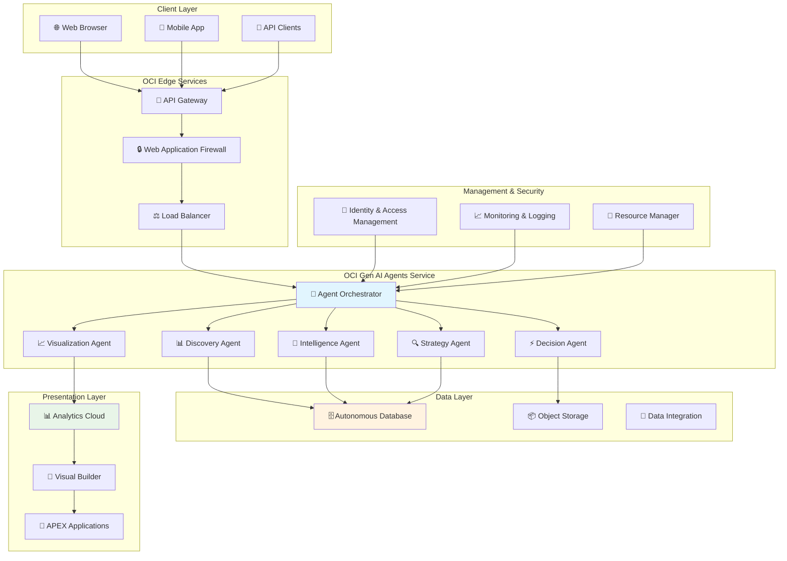
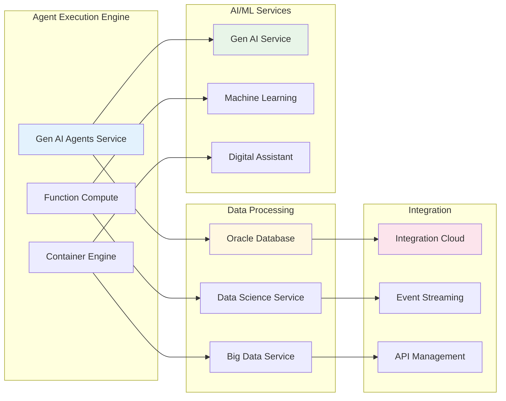

# Oracle OCI Deployment Guide - Decisioning Agentic Flow

## 🚀 Complete Guide to Deploying on Oracle Cloud Infrastructure

### Overview

This guide covers deploying the Decisioning Agentic Flow system on Oracle Cloud Infrastructure (OCI) using Gen AI Agents service, providing enterprise-scale autonomous business intelligence with native Oracle integration.

## 🏗️ OCI Architecture Design

### High-Level Architecture



### Detailed Component Architecture



## 📋 Prerequisites

### OCI Account Setup
1. **OCI Tenancy** with appropriate service limits
2. **Compartment** for project resources
3. **User Permissions** for AI services and database access
4. **API Keys** configured for CLI access

### Required OCI Services
- Oracle Gen AI Agents Service
- Autonomous Database (ATP/ADW)
- Functions Service
- API Gateway
- Analytics Cloud
- Object Storage
- Resource Manager

### Local Development Setup
```bash
# Install OCI CLI
curl -L https://raw.githubusercontent.com/oracle/oci-cli/master/scripts/install/install.sh | bash

# Configure OCI CLI
oci setup config

# Install required Python packages
pip install oci oci-cli
```

## 🚀 Phase 1: Infrastructure Setup

### 1.1 Create OCI Resource Manager Stack

**Create `terraform/main.tf`:**
```hcl
terraform {
  required_providers {
    oci = {
      source = "oracle/oci"
      version = ">= 4.0.0"
    }
  }
}

# Variables
variable "tenancy_ocid" {}
variable "compartment_ocid" {}
variable "region" {}

# Provider configuration
provider "oci" {
  tenancy_ocid = var.tenancy_ocid
  region       = var.region
}

# Compartment for decisioning agents
resource "oci_identity_compartment" "decisioning_compartment" {
  compartment_id = var.compartment_ocid
  description    = "Decisioning Agentic Flow Resources"
  name           = "decisioning-agents"
}

# Autonomous Database
resource "oci_database_autonomous_database" "decisioning_db" {
  compartment_id           = oci_identity_compartment.decisioning_compartment.id
  cpu_core_count          = 1
  data_storage_size_in_tbs = 1
  db_name                 = "DECISIONDB"
  display_name            = "Decisioning Database"

  admin_password = var.db_admin_password

  # Enable serverless for cost optimization
  is_auto_scaling_enabled = true
  is_serverless           = true
}

# Object Storage Bucket
resource "oci_objectstorage_bucket" "decisioning_bucket" {
  compartment_id = oci_identity_compartment.decisioning_compartment.id
  name           = "decisioning-artifacts"
  namespace      = data.oci_objectstorage_namespace.namespace.namespace
}

# API Gateway
resource "oci_apigateway_gateway" "decisioning_gateway" {
  compartment_id = oci_identity_compartment.decisioning_compartment.id
  endpoint_type  = "PUBLIC"
  display_name   = "Decisioning API Gateway"

  subnet_id = oci_core_subnet.public_subnet.id
}
```

### 1.2 Deploy Infrastructure
```bash
# Initialize Terraform
cd terraform
terraform init

# Plan deployment
terraform plan -var-file="terraform.tfvars"

# Deploy infrastructure
terraform apply -var-file="terraform.tfvars"
```

### 1.3 Network Configuration

**Create `terraform/network.tf`:**
```hcl
# Virtual Cloud Network
resource "oci_core_vcn" "decisioning_vcn" {
  compartment_id = oci_identity_compartment.decisioning_compartment.id
  cidr_blocks    = ["10.0.0.0/16"]
  display_name   = "decisioning-vcn"
  dns_label      = "decisionvcn"
}

# Internet Gateway
resource "oci_core_internet_gateway" "decisioning_igw" {
  compartment_id = oci_identity_compartment.decisioning_compartment.id
  vcn_id         = oci_core_vcn.decisioning_vcn.id
  display_name   = "decisioning-igw"
}

# Public Subnet
resource "oci_core_subnet" "public_subnet" {
  compartment_id = oci_identity_compartment.decisioning_compartment.id
  vcn_id         = oci_core_vcn.decisioning_vcn.id
  cidr_block     = "10.0.1.0/24"
  display_name   = "public-subnet"
  dns_label      = "publicsub"

  route_table_id = oci_core_route_table.public_route_table.id
}

# Route Table
resource "oci_core_route_table" "public_route_table" {
  compartment_id = oci_identity_compartment.decisioning_compartment.id
  vcn_id         = oci_core_vcn.decisioning_vcn.id
  display_name   = "public-route-table"

  route_rules {
    destination       = "0.0.0.0/0"
    network_entity_id = oci_core_internet_gateway.decisioning_igw.id
  }
}
```

## 🤖 Phase 2: Gen AI Agents Deployment

### 2.1 Agent Service Configuration

**Create `agents/agent_config.yaml`:**
```yaml
apiVersion: v1
kind: GenAIAgentConfig
metadata:
  name: decisioning-orchestrator
  namespace: decisioning-agents
spec:
  agents:
    - name: discovery-agent
      type: data-discovery
      config:
        timeout: 300
        retry_attempts: 3
        data_sources:
          - type: autonomous_database
            connection_string: ${DB_CONNECTION_STRING}

    - name: intelligence-agent
      type: business-analytics
      config:
        timeout: 600
        parallel_queries: true
        metrics:
          - financial_health
          - operational_efficiency

    - name: strategy-agent
      type: pattern-recognition
      config:
        timeout: 450
        ml_models:
          - trend_analysis
          - risk_assessment

    - name: decision-agent
      type: decision-synthesis
      config:
        timeout: 300
        prioritization_framework: business_impact

    - name: visualization-agent
      type: dashboard-generation
      config:
        timeout: 200
        output_formats:
          - analytics_cloud
          - apex_dashboard

  orchestration:
    execution_mode: parallel
    max_concurrent_agents: 4
    result_aggregation: true
```

### 2.2 Deploy Agent Functions

**Create `functions/discovery_agent/func.py`:**
```python
import json
import oci
from fdk import response

def handler(ctx, data: io.BytesIO = None):
    """Discovery Agent Function"""
    try:
        # Parse input
        input_data = json.loads(data.getvalue())

        # Initialize OCI clients
        config = oci.config.from_file()
        db_client = oci.database.DatabaseClient(config)

        # Execute discovery logic
        result = execute_discovery_analysis(input_data, db_client)

        return response.Response(
            ctx,
            response_data=json.dumps(result),
            headers={"Content-Type": "application/json"}
        )

    except Exception as e:
        return response.Response(
            ctx,
            response_data=json.dumps({"error": str(e)}),
            headers={"Content-Type": "application/json"},
            status_code=500
        )

def execute_discovery_analysis(input_data, db_client):
    """Core discovery logic"""
    # Implementation matches orchestrator.py discovery agent
    return {
        "agent_name": "discovery",
        "status": "success",
        "data": {
            "data_ecosystem": {},
            "business_entities": {},
            "data_relationships": {}
        },
        "insights": [],
        "recommendations": [],
        "confidence_score": 0.95
    }
```

**Deploy Functions:**
```bash
# Create application
oci fn application create \
  --compartment-id $COMPARTMENT_ID \
  --display-name decisioning-agents

# Deploy each agent function
fn deploy --app decisioning-agents --local
```

### 2.3 API Gateway Configuration

**Create `api/deployment.yaml`:**
```yaml
kind: Deployment
apiVersion: gateway.oci.oracle.com/v1beta1
metadata:
  name: decisioning-api
spec:
  compartmentId: ${COMPARTMENT_OCID}
  gatewayId: ${GATEWAY_OCID}
  pathPrefix: /decisioning/v1
  specification:
    routes:
      - path: /analysis
        methods:
          - POST
        backend:
          type: ORACLE_FUNCTIONS_BACKEND
          functionId: ${ORCHESTRATOR_FUNCTION_OCID}

      - path: /dashboard
        methods:
          - GET
        backend:
          type: HTTP_BACKEND
          url: ${ANALYTICS_CLOUD_URL}

      - path: /health
        methods:
          - GET
        backend:
          type: STOCK_RESPONSE_BACKEND
          status: 200
          body: '{"status": "healthy"}'
```

## 📊 Phase 3: Analytics & Visualization

### 3.1 Oracle Analytics Cloud Setup

**Create Analytics Cloud Instance:**
```bash
# Create OAC instance
oci analytics analytics-instance create \
  --compartment-id $COMPARTMENT_ID \
  --feature-set ENTERPRISE \
  --license-type LICENSE_INCLUDED \
  --name decisioning-analytics \
  --capacity-type OLPU_COUNT \
  --capacity-value 1
```

**Dashboard Configuration (`analytics/dashboard_spec.json`):**
```json
{
  "dashboardConfig": {
    "name": "Decisioning Executive Dashboard",
    "description": "AI-Generated Business Intelligence Dashboard",
    "layout": {
      "sections": [
        {
          "title": "Critical Alerts",
          "type": "alert_panel",
          "visualizations": [
            {
              "type": "kpi_card",
              "metric": "business_health_score",
              "threshold": 70,
              "alertLevel": "critical"
            }
          ]
        },
        {
          "title": "Financial Intelligence",
          "type": "chart_panel",
          "visualizations": [
            {
              "type": "line_chart",
              "data_source": "financial_metrics",
              "x_axis": "date",
              "y_axis": "revenue"
            },
            {
              "type": "gauge_chart",
              "data_source": "collection_efficiency",
              "target": 85
            }
          ]
        },
        {
          "title": "Strategic Decisions",
          "type": "action_panel",
          "visualizations": [
            {
              "type": "priority_matrix",
              "data_source": "decision_framework"
            }
          ]
        }
      ]
    }
  }
}
```

### 3.2 APEX Application Deployment

**Create `apex/decisioning_app.sql`:**
```sql
-- Create APEX Application
begin
    apex_application_install.set_application_id(100);
    apex_application_install.generate_offset;
    apex_application_install.set_schema('DECISIONING_SCHEMA');
    apex_application_install.set_application_alias('DECISIONING');
end;
/

-- Create Dashboard Page
begin
    apex_page.create_page (
        p_id => 1,
        p_name => 'Executive Dashboard',
        p_alias => 'DASHBOARD',
        p_page_template => 'Standard',
        p_page_mode => 'NORMAL'
    );
end;
/

-- Add Business Health Chart
begin
    apex_region.create_region (
        p_page_id => 1,
        p_name => 'Business Health Score',
        p_source_type => 'REST_SOURCE',
        p_source => 'SELECT * FROM decisioning_results WHERE metric = ''business_health''',
        p_region_template => 'Content Block'
    );
end;
/
```

## 🔄 Phase 4: Integration & Automation

### 4.1 Event-Driven Processing

**Create `events/event_rules.yaml`:**
```yaml
apiVersion: events.oci.oracle.com/v1
kind: EventRule
metadata:
  name: decisioning-data-changes
spec:
  compartmentId: ${COMPARTMENT_OCID}
  condition: |
    {
      "eventType": "com.oraclecloud.databaseservice.autonomous.database.critical",
      "source": "autonomous-database"
    }
  actions:
    - actionType: FAAS
      isEnabled: true
      functionId: ${ORCHESTRATOR_FUNCTION_OCID}
      description: "Trigger decisioning analysis on data changes"
```

### 4.2 Scheduled Execution

**Create `scheduler/daily_analysis.yaml`:**
```yaml
apiVersion: batch/v1
kind: CronJob
metadata:
  name: daily-decisioning-analysis
spec:
  schedule: "0 6 * * *"  # Daily at 6 AM
  jobTemplate:
    spec:
      template:
        spec:
          containers:
          - name: decisioning-runner
            image: ${CONTAINER_REGISTRY}/decisioning-orchestrator:latest
            env:
            - name: ANALYSIS_TYPE
              value: "strategic_business_health"
            - name: OCI_CONFIG_FILE
              value: "/etc/oci/config"
          restartPolicy: OnFailure
```

### 4.3 Monitoring & Alerting

**Create `monitoring/alerts.yaml`:**
```yaml
apiVersion: monitoring.oci.oracle.com/v1
kind: Alarm
metadata:
  name: decisioning-agent-failures
spec:
  compartmentId: ${COMPARTMENT_OCID}
  destinations:
    - ${NOTIFICATION_TOPIC_OCID}
  metricCompartmentId: ${COMPARTMENT_OCID}
  namespace: oci_faas
  query: |
    Errors[1m].sum() > 5
  severity: CRITICAL
  alarmSummary: "Decisioning agents experiencing high error rate"
```

## 🔒 Phase 5: Security & Compliance

### 5.1 Identity & Access Management

**Create `security/policies.tf`:**
```hcl
# Dynamic Group for Functions
resource "oci_identity_dynamic_group" "decisioning_functions" {
  compartment_id = var.tenancy_ocid
  name           = "decisioning-functions"
  description    = "Dynamic group for decisioning agent functions"
  matching_rule  = "ALL {resource.type = 'fnfunc', resource.compartment.id = '${oci_identity_compartment.decisioning_compartment.id}'}"
}

# Policy for Database Access
resource "oci_identity_policy" "decisioning_policy" {
  compartment_id = oci_identity_compartment.decisioning_compartment.id
  name           = "decisioning-agents-policy"
  description    = "Policy for decisioning agents to access resources"

  statements = [
    "Allow dynamic-group decisioning-functions to use autonomous-databases in compartment decisioning-agents",
    "Allow dynamic-group decisioning-functions to manage objects in compartment decisioning-agents",
    "Allow dynamic-group decisioning-functions to use analytics-clouds in compartment decisioning-agents"
  ]
}
```

### 5.2 Data Encryption

**Create `security/encryption.tf`:**
```hcl
# Vault for Key Management
resource "oci_kms_vault" "decisioning_vault" {
  compartment_id = oci_identity_compartment.decisioning_compartment.id
  display_name   = "decisioning-vault"
  vault_type     = "DEFAULT"
}

# Master Encryption Key
resource "oci_kms_key" "decisioning_key" {
  compartment_id = oci_identity_compartment.decisioning_compartment.id
  display_name   = "decisioning-master-key"
  management_endpoint = oci_kms_vault.decisioning_vault.management_endpoint

  key_shape {
    algorithm = "AES"
    length    = 256
  }
}
```

## 📈 Phase 6: Performance Optimization

### 6.1 Auto-Scaling Configuration

**Create `scaling/autoscaling.yaml`:**
```yaml
apiVersion: autoscaling.oci.oracle.com/v1
kind: AutoScalingConfiguration
metadata:
  name: decisioning-agents-scaling
spec:
  compartmentId: ${COMPARTMENT_OCID}
  policies:
    - displayName: "Scale Out Policy"
      policyType: "threshold"
      capacity:
        initial: 1
        max: 10
        min: 1
      rules:
        - action:
            type: "CHANGE_COUNT_BY"
            value: 2
          metric:
            metricType: "CPU_UTILIZATION"
            threshold:
              operator: "GT"
              value: 80
```

### 6.2 Caching Strategy

**Create `cache/redis_config.yaml`:**
```yaml
apiVersion: v1
kind: ConfigMap
metadata:
  name: decisioning-cache-config
data:
  redis.conf: |
    # Cache configuration for agent results
    maxmemory 256mb
    maxmemory-policy allkeys-lru
    save 900 1
    save 300 10
    save 60 10000
```

## 🚀 Deployment Commands

### Complete Deployment Script

**Create `deploy/deploy_all.sh`:**
```bash
#!/bin/bash
set -e

echo "🚀 Deploying Decisioning Agentic Flow to OCI..."

# Phase 1: Infrastructure
echo "📋 Phase 1: Deploying Infrastructure..."
cd terraform
terraform init
terraform apply -auto-approve -var-file="production.tfvars"

# Phase 2: Functions
echo "🤖 Phase 2: Deploying Agent Functions..."
cd ../functions
fn create app decisioning-agents --annotation oracle.com/oci/subnetIds='["'$SUBNET_ID'"]'
find . -name func.yaml -execdir fn deploy \;

# Phase 3: Analytics
echo "📊 Phase 3: Setting up Analytics..."
cd ../analytics
oci analytics analytics-instance create --from-json file://oac_config.json

# Phase 4: API Gateway
echo "🚪 Phase 4: Configuring API Gateway..."
cd ../api
oci api-gateway deployment create --from-json file://api_deployment.json

# Phase 5: Security
echo "🔒 Phase 5: Applying Security Policies..."
cd ../security
terraform init
terraform apply -auto-approve

echo "✅ Deployment Complete!"
echo "🔗 Dashboard URL: https://${OAC_INSTANCE_URL}/dv"
echo "🔗 API Endpoint: https://${API_GATEWAY_URL}/decisioning/v1"
```

### Health Check Script

**Create `scripts/health_check.sh`:**
```bash
#!/bin/bash

echo "🔍 Checking Decisioning Agentic Flow Health..."

# Check API Gateway
echo "📡 Checking API Gateway..."
curl -f "${API_GATEWAY_URL}/decisioning/v1/health" || echo "❌ API Gateway failed"

# Check Database
echo "🗄️ Checking Database..."
oci db autonomous-database get --autonomous-database-id $DB_OCID --query 'data."lifecycle-state"'

# Check Functions
echo "🤖 Checking Agent Functions..."
fn list functions decisioning-agents

# Check Analytics Cloud
echo "📊 Checking Analytics Cloud..."
oci analytics analytics-instance get --analytics-instance-id $OAC_OCID --query 'data."lifecycle-state"'

echo "✅ Health check complete!"
```

---

## 🎯 Next Steps

1. **Run Infrastructure Deployment**: `./deploy/deploy_all.sh`
2. **Configure Data Sources**: Update database connections
3. **Test Agent Execution**: Run sample analysis
4. **Set up Monitoring**: Configure alerts and dashboards
5. **Schedule Automation**: Enable daily/weekly analysis runs

This comprehensive guide provides everything needed to deploy the Decisioning Agentic Flow on Oracle OCI with enterprise-grade capabilities!